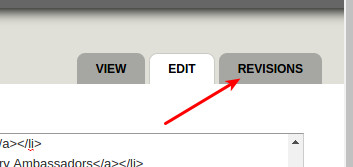
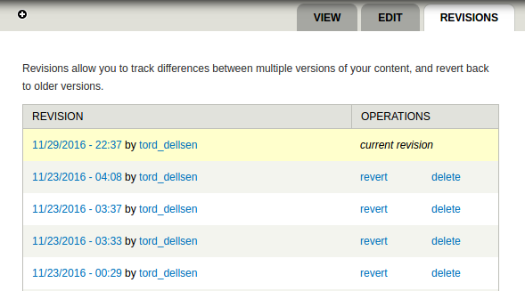

This guide is for people that want to do tasks like:
* Occasionally updating static pages ("basic pages" in Drupal)
* Analyze user statistics in CiviCRM
* ___

# Drupal

## Editing or creating pages

### Creating a new page

First [log in](https://peoplesfundglobal.org/user) and then click on the "add content" shortcut

(Or go to "content first and then click on "+ add content")

The static pages on the website (available from the menu) mostly uses a html template, which you can find [here](https://github.com/peoples-fund/peoples-fund/tree/master/page-templates)

### Editing a page

For adding images to to a page: [how-to-add-photos](how-to-add-photos.md)

Editing modes: There are two ways of editing a page, either you can use the "Full Html" text format view (which is the default), or you can switch to the "Plain text" text format view:

Using "Full html" is safer but a little bit trickier since you need some basic understanding of html. Using "Plain text" gives you a so-called wysiwyg (what you see is what you get) interface, but it is not very reliable and may mess things up not just where you edit but in other places on the same page. Therefore if you use "Plain text" the next section below - "Reverting to a previous version" - is extra important

### Reverting to a previous version

All pages are version controlled, this means that it's possible to go back to earlier versions if we like

Once you are on the edit page, you can find the revisions by clicking on the tab with the same name:

From there you have the option to *revert* to an earlier version:

### Troubleshooting

#### The page is not formatted with the html i have written

Please use "Full HTML" (rather than plain text)

# CiviCRM

## Getting information about users

## Seeing user statistics

## 

