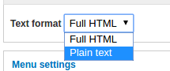
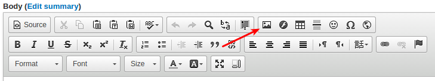
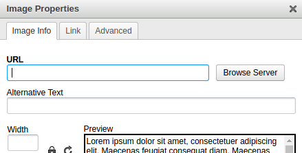
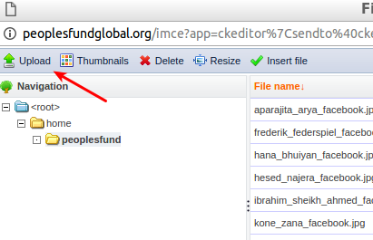

## Option 1: The easy way

1. Open the page editor for one of the site pages

2. Change from "Full HTML" to "Plain text" (can be done at the bottom of the editing window)

3. Find and click on the "image" toolbar button

4. click on the browse server button

5. click on the upload button

6. click on "choose file"

7. click on "upload"

8. click on "insert file"
The "URL" field should now contain the following:

> /sites/default/files/home/peoplesfund/{name of image}

9. click on "ok"

***Please make sure that the page is not broken after you are done, in other words please check that things are working ok***

## Option 2: The nerdy way (safer)

1. Upload the file
  * Using and FTP client or
  * Using the cpanel interface
to this directory: `/www/www/sites/default/files/home/peoplesfund/`

2. Open the page editor for one of our web pages
  * and make sure we are in html editing mode

3. Add the following html code

``

Please note that the `/www/www` has been left out

***

### Appendix: Uploading images
..without adding them using the drupal web interface

1. Go to https://peoplesfundglobal.org/user

2. Click on "File Browser"

3. Click on "Upload" etc (see instructions under option 1 above)
